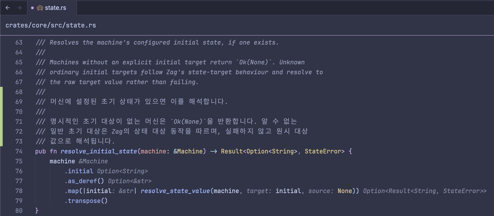
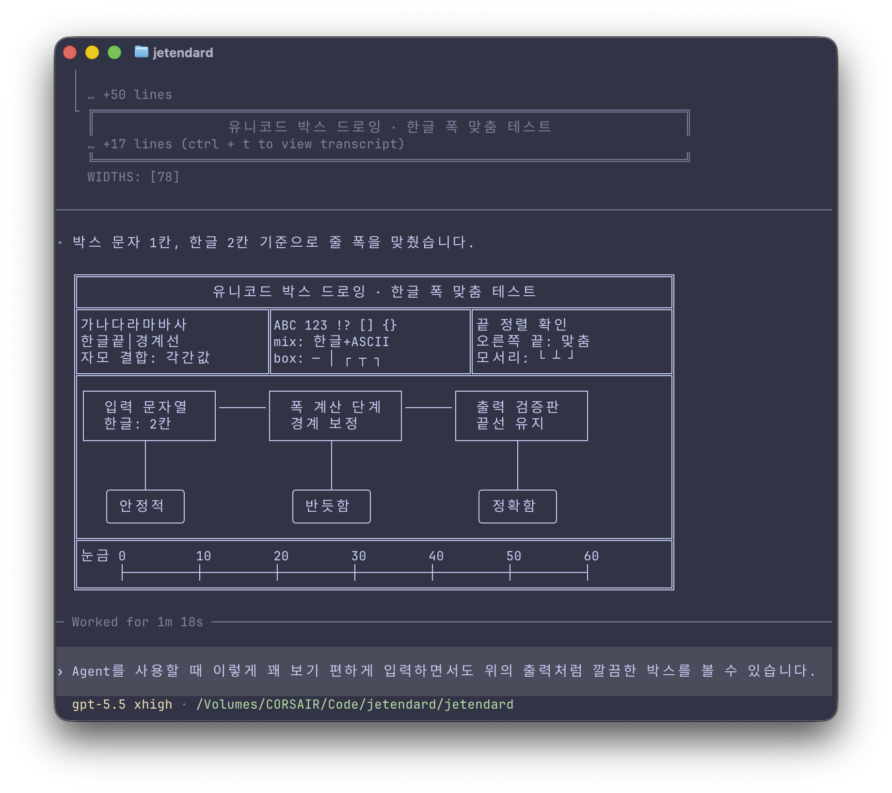

# D2tendard

This project is heavily inspired by
[Yeomil Mono](https://github.com/taevel02/yeomil-mono) and reuses much of its
implementation with minimal changes. Compared with
[Yeomil Mono](https://github.com/taevel02/yeomil-mono), D2tendard uses
JetBrainsMono Nerd Font Mono instead of
[Geist Mono](https://github.com/vercel/geist-font/tree/main/fonts/GeistMono)
and applies a `1.15` scale to
[Pretendard](https://github.com/orioncactus/pretendard). Slightly enlarging
Pretendard reduces unnecessary spacing around Korean glyphs, making Korean word
spacing feel more visually stable while improving the clarity and precision of
Hangul rendering.

D2tendard is a reproducible font build project that combines
[JetBrainsMono Nerd Font Mono](https://github.com/ryanoasis/nerd-fonts) with
[Pretendard](https://github.com/orioncactus/pretendard) Korean glyphs.

The generated family is named `D2tendard`. Latin glyphs, programming ligatures,
and Nerd Font symbols come from the ligature-enabled `JetBrainsMonoNerdFontMono`
files. Korean and CJK glyphs come from Pretendard and are fitted into exactly two
Latin monospace advances.

Glyphs that neither base font covers are filled from
[D2Coding](https://github.com/naver/d2codingfont): Hanja, kana, enclosed
alphanumerics such as `①`, enclosed Hangul letters such as `㈀`, and extended
arrows. Each filled glyph keeps D2Coding's own half/full-width convention, so it
lands on exactly one or two Latin advances. Latin Extended letters missing from
JetBrains Mono are filled from Pretendard at one Latin advance.

**Zed Editor (font size 13.5)**


**Zed Editor (Korean comments)**


**Ghostty Terminal (Text Output)**


**Ghostty Terminal (Codex)**



## Build

```bash
uv sync --all-groups
make download
make run
make test
```

`make run` builds the full 16-variant family. 

Generated files are written to:

- `fonts/ttf/D2tendard-*.ttf`
- `fonts/otf/D2tendard-*.otf`
- `fonts/webfont/D2tendard-*.woff2`
- `fonts/webfont/d2tendard.css`

Generated outputs and upstream downloads are intentionally ignored by git.

## CLI

```bash
uv run jetendard --help
```

Important options:

- `--latin-dir`: directory containing `JetBrainsMonoNerdFontMono-*.ttf`
- `--cjk-dir`: directory containing `Pretendard-*.ttf`
- `--fallback-dir`: directory containing `D2Coding-*.ttf` used to fill glyphs
  missing from both base fonts
- `--all`: build the full 16-variant matrix
- `--variants`: explicit output variants such as `Regular`, `Italic`, or `BoldItalic`
- `--weights`: weights to build; without `--styles`, this selects upright variants
- `--styles`: `normal`, `italic`, or both
- `--korean-italic-mode`: Korean/CJK policy for italic variants, currently `upright`
- `--korean-scale`: visual scale for Korean/CJK glyph fitting
- `--scale`: compatibility alias for `--korean-scale`

The default Korean scale is `1.15`.

Examples:

```bash
uv run jetendard --all
uv run jetendard --weights Regular Bold --styles normal italic
uv run jetendard --variants Regular Light Bold
```

## Variant Coverage

D2tendard builds every ligature-enabled `JetBrainsMonoNerdFontMono` Mono TTF
variant present in the pinned Nerd Fonts archive:

| Weight | Upright | Italic | Pretendard Korean/CJK source |
| --- | --- | --- | --- |
| Thin | `D2tendard-Thin` | `D2tendard-ThinItalic` | `Pretendard-Thin` |
| ExtraLight | `D2tendard-ExtraLight` | `D2tendard-ExtraLightItalic` | `Pretendard-ExtraLight` |
| Light | `D2tendard-Light` | `D2tendard-LightItalic` | `Pretendard-Light` |
| Regular | `D2tendard-Regular` | `D2tendard-Italic` | `Pretendard-Regular` |
| Medium | `D2tendard-Medium` | `D2tendard-MediumItalic` | `Pretendard-Medium` |
| SemiBold | `D2tendard-SemiBold` | `D2tendard-SemiBoldItalic` | `Pretendard-SemiBold` |
| Bold | `D2tendard-Bold` | `D2tendard-BoldItalic` | `Pretendard-Bold` |
| ExtraBold | `D2tendard-ExtraBold` | `D2tendard-ExtraBoldItalic` | `Pretendard-ExtraBold` |

Pretendard does not provide true static italic Korean/CJK fonts in the pinned
archive, so italic D2tendard variants use italic JetBrainsMono Latin glyphs and
upright Pretendard Korean/CJK glyphs. The generated font metadata and CSS still
identify those variants as italic.

D2Coding only ships Regular and Bold, so fallback glyphs use `D2Coding-Regular`
for Thin through Medium and `D2Coding-Bold` for SemiBold through ExtraBold, in
both upright and italic variants.

## Scope

D2tendard only uses `JetBrainsMonoNerdFontMono`. It does not use
`JetBrainsMonoNerdFont`, `JetBrainsMonoNerdFontPropo`, or `JetBrainsMonoNL`
no-ligature variants. Because the base font is already Nerd Font patched, this
project does not run a second Nerd Fonts patching step.

`Pretendard-Black` is not built by default because the confirmed
`JetBrainsMonoNerdFontMono` archive does not contain a matching Black source.
The downloader also extracts `PretendardVariable.ttf` when available for future
custom-weight work.

## Visual Check Samples

Use the same renderer, point size, and line height when comparing D2tendard
against yeomil-mono or another monospace baseline:

```text
D2tendard 테스트 ABC abc 0123456789
가각간갇갈감갑값같꿇뷁힣
한글과 English가 섞인 source comment
if (상태 === "완료") return "성공";
ㄱㄴㄷㅏㅑㅓㅕㅗㅛㅜㅠㅡㅣ
（）［］｛｝，．：；！？
```

## Release Packaging

The build writes installable files under `fonts/ttf`, `fonts/otf`, and
`fonts/webfont`. Release archives can be prepared from those directories after a
manual visual pass confirms the default Korean scale across upright and italic
variants. The OTF files are OTF-compatible outputs using the same TrueType
outlines as the generated TTFs.

## License

D2tendard is distributed under the [SIL Open Font License 1.1](LICENSE). Review
the upstream JetBrains Mono, Nerd Fonts, Pretendard, D2Coding, and Yeomil Mono
projects for their full copyright and reserved-name notices.
